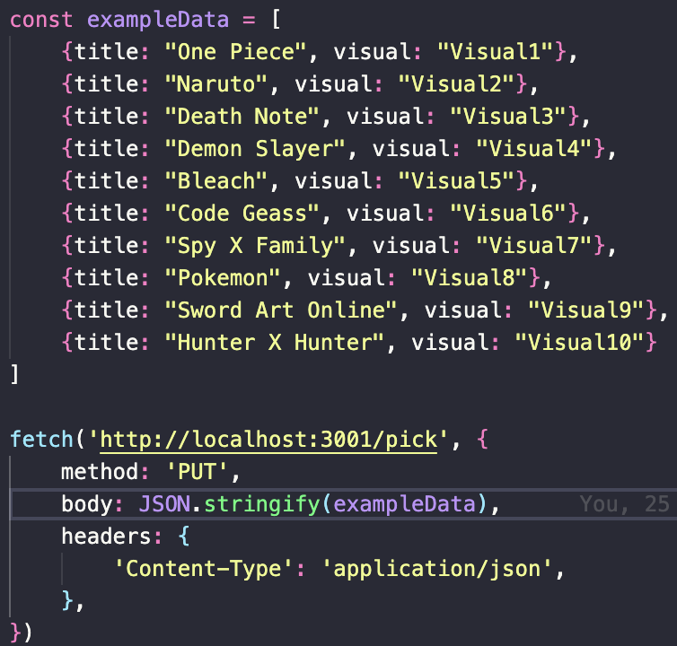
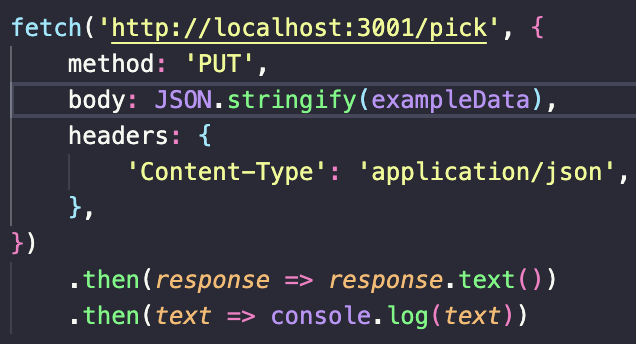
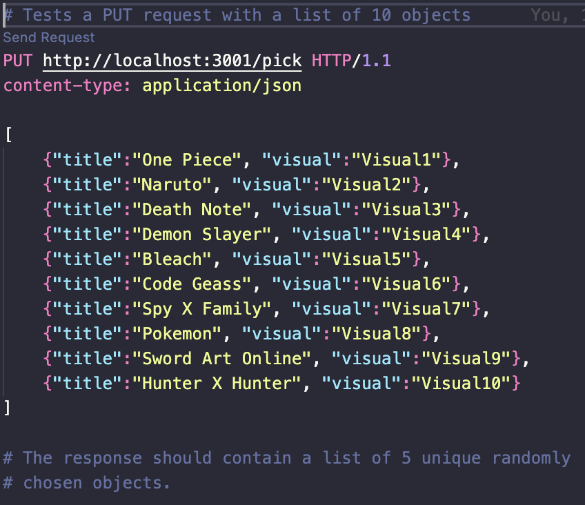
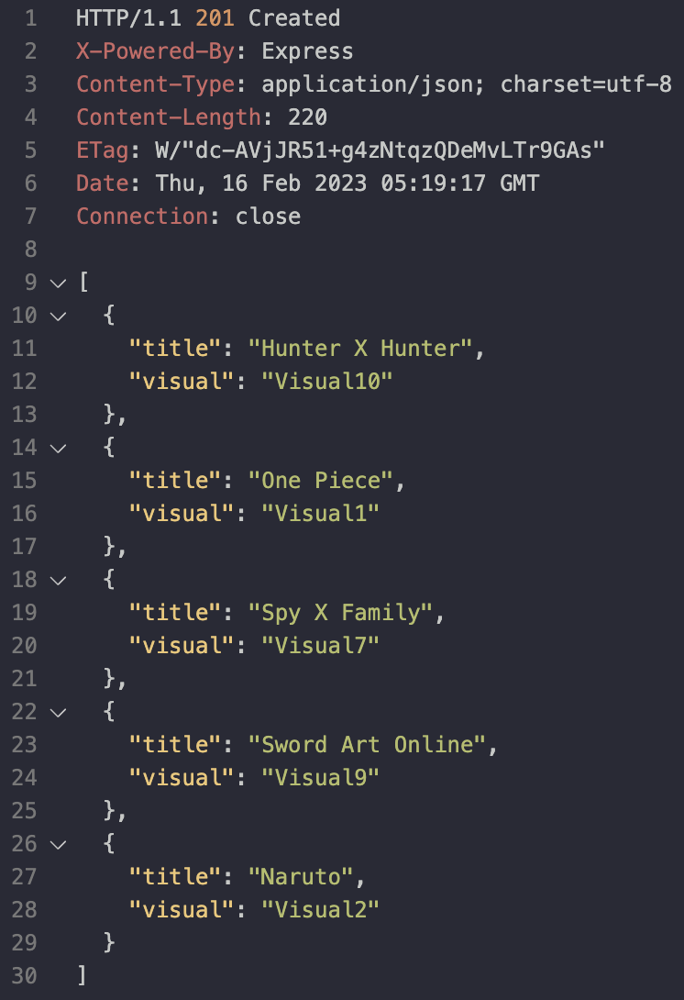
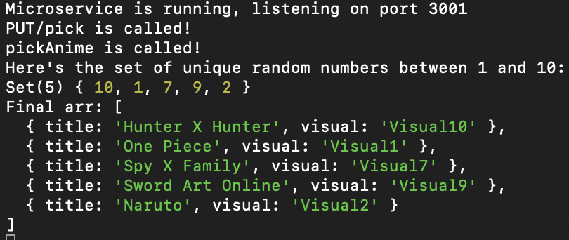

# Microservice for KyoAniNote

Input: 
This microservice will receive a list containing 10 anime objects from the client. 
Format = JSON, wrapper = list, Keys = "title","visual"

Output: 
This microservice will then randomly pick 5 of the received anime objects, and then respond to the client with a list of the picked objects. 
Format = JSON, wrapper = list, Keys = "title","visual"

# Communication Contract

## How to request data

Call the fetch() with the target URL, which is "http://localhost:3001:pick" in developer mode. 
See the image below for example parameters:  

## How to receive data

The fetch() call will generate a response which will contain a list of the picked objects, formated as JSON. 
You can then grab the data, and use it within your own program. 
See the image below for an example usecase: 

### How to launch microservice
<ul>
  <li>cd into the "microservice" folder</li>
  <li>npm install</li>
  <li>npm start (or optionally, "npm start:dev" for nodemon support)</li>
</ul>

### Example HTTP request

### Example HTTP response

### Example Console log

UML Sequence Diagram:
